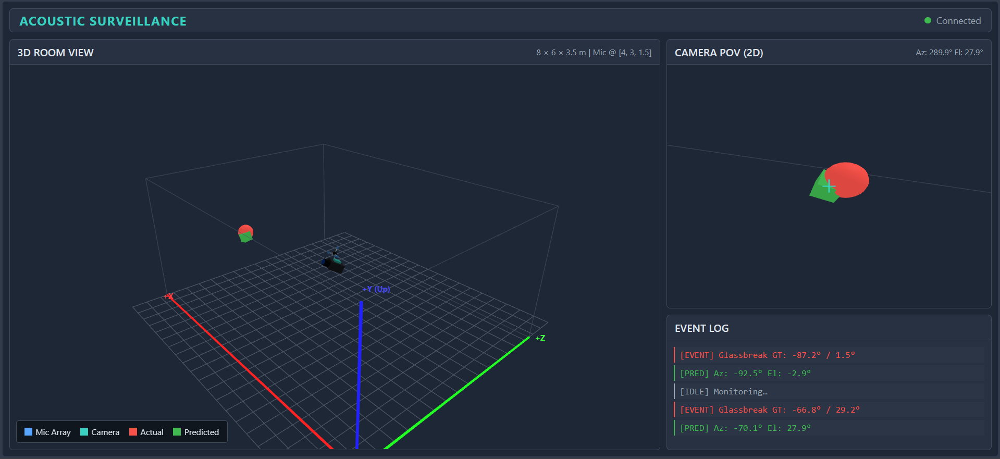

# Acoustic Sound Event Detection and Localization



A real-time audio analysis system and ML pipeline for acoustic surveillance. This project simulates a continuous multi-channel audio stream from a 4-microphone array in a 3D room, detects threatening sound events, determines their direction of arrival, and visualizes the results in real-time.

## Features

- **Stream Simulation**: Generates a realistic 4-channel audio stream using `pyroomacoustics` (Image Source Method).
- **Sound Event Detection (SED)**: Uses a fine-tuned CNN14 model to detect specific sounds (e.g., gunshots, sirens, glass breaks, explosions).
- **Direction of Arrival (DOA)**: Localizes the detected sounds in 3D space (azimuth and elevation) using a custom 1D CNN (SSLModel) operating on GCC-PHAT features.
- **Real-Time Visualization**: A browser-based 3D dashboard built with Three.js and Flask/Socket.IO to visualize the room, microphone array, IP camera model, and detected sound events.
- **Automated Reporting**: Generates quantitative session performance reports (SED metrics, DOA angular errors) automatically.

## Directory Structure

- `config.py`: Global system configuration (physical constants, geometry, thresholds).
- `dsp/`: Core Digital Signal Processing utilities (GCC-PHAT, coordinate conversions, etc).
- `sed/`: Sound Event Detection module (CNN14 model, API, training pipeline).
- `doa/`: Direction of Arrival module (SSLModel, API, synthetic data generator, training).
- `stream/`: Audio stream simulation and real-time inference pipeline.
- `web_visualization/`: Flask server and Three.js frontend for live viewing.
- `samples/`: Raw audio sample library used for generation/simulation.
- `reports/`: Auto-generated offline session evaluation reports.

## Installation

Ensure you have Python 3.x installed. Install the necessary dependencies via:

```bash
pip install -r requirements.txt
```

## How to Run

You can run the inference pipeline in two modes:

### 1. Terminal Only
Runs the continuous audio generation and text-based outputs to the terminal.
```bash
python stream/pipeline.py
```

### 2. With Web Visualization
Runs the real-time simulation alongside the Flask backend. Open the provided live dashboard URL in your browser to see the 3D visualization.
```bash
python stream/pipeline.py --viz
```

## Testing

There are automated scripts to quickly test individual components:
- `python test_sed.py`: Quick test for the SED model.
- `python test_doa.py`: Quick test for the DOA model.
- `python test_runner.py`: Offline DOA batch evaluation.
- `python test_unforeseen.py`: Tests the pipeline against unforeseen audio logic.
